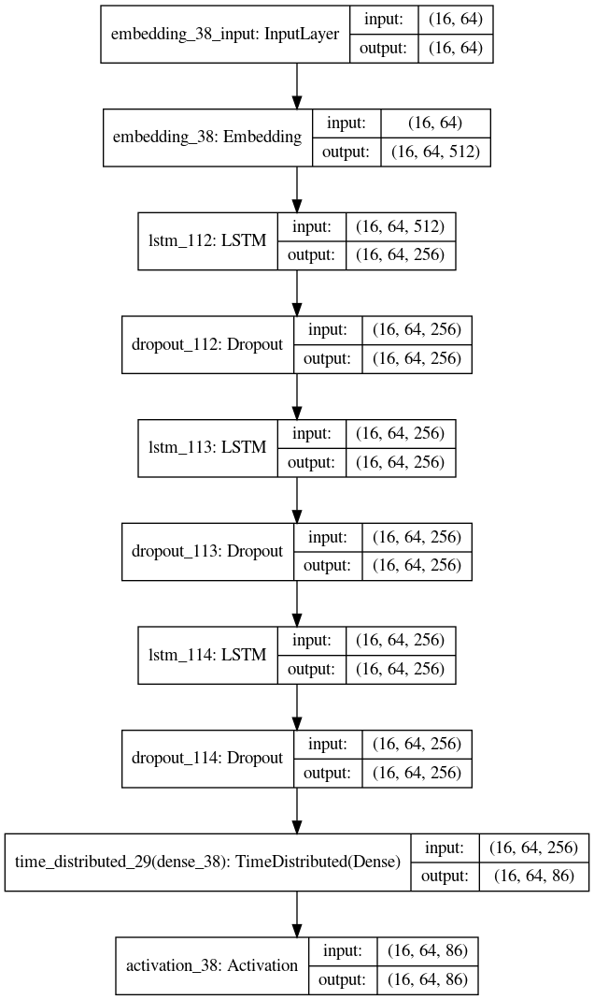

<h1>Generating Music using Deep Neural Networks:</h1>

I was very curious about how Recurrent Neural Networks are used to generate music which is what inspired me to go on to build this project. I will describe briefly about how I went about in building this system.

## Dataset:

-> The dataset used for training the model was encoded in a special way in which music is represented which is called "ABC notation".<br/>
-> The dataset had about 340 tunes which it was trained with and had  86 unique characters in the dataset.<br/>
-> Each of the characters are encoded as numbers. So we have a number between 0 and 85 representing each of the character in the dataset.

## Description of the Model and the input:

-> We are using a RNN based model here where we have an embedding layer in the beginnig which takes each input which is a number between 0 and 86 and converts them to a 512 dimension vector.<br/>
-> This input is then given to an RNN layer which is followed by 2 more RNN layers. We use a many to many network , hence an output is taken at each of the time steps. Hence we have a time distributed Dense layer after the RNN layers which is a dense layer giving 86 probabilities.<br/>
-> The 86 probabilities are then pased to a multiclass-log loss function.

## The model looks like the follows:


```python
modelo=build_model(16,64,86)
plot_model(modelo,show_shapes=True)
```





## Preparation of the dataset for input:

-> The dataset is totally 129665 characters long. This is divided into batches of 16 in which each of the training sample has 64 characters each. Hence the batch shape is going to be a 16X64 matrix and the label will be a 16X64X86 matrix in which each 86 dimensionsal vector is a one-hot encoded version of the character which occurs exactly at one position after the corresponding cell in the input. For eaxmple, the cell 1X2 in the input batch will have a one-hot encoded vector version of the character which occurs at 1X3 in the input.

## An example output:

M9gj2n8A2 E2e|d2e e2d|G3 :|\ne2d c2B|ABc dBc|dBg dBG|\nccc d2e|B2B dBG|EEF G2D|G3 :|\n\n\nX: 136\nT:Gianson\'s Jig\n% Nottingham Music Database\nS:Trad, arr Phil Rowe\nM:6/8\nK:G\ndf|:"G""Bb"DFB "Am"ABc|"Bm"Bba "Em"gag|"Bm"fef "F#7"edc|"Bm"BcB B::\nf2e -def|"Em"g2b g2b|"F#7"f2f "Bm"f2d|"Em"e2d "A7"e2f|\n"D7"ded cB

<b> An example of the output generated can be seen above. To test it out, all you have to do is copy and paste the above in the link below</b>
https://abcjs.net/abcjs-editor.html
## Importing the necessary libraries:


```python
import numpy as np
import os
from keras.models import Sequential, load_model
from keras.layers import LSTM, Dropout, TimeDistributed, Dense, Activation, Embedding
import json
from tqdm.auto import tqdm
from keras.utils import plot_model
from IPython.display import Image
from IPython.core.display import HTML
```

## Defining the log files where data will be stored:

<b>Below we also define how large each of the batches should be and the length of each of the sequences</b>


```python
DATA_DIR = './new'
LOG_DIR = './logs'
BATCH_SIZE = 16
SEQ_LENGTH = 64
```

## We define a logging function which help store the accuracy and other details at every 10 epochs:


```python
class TrainLogger(object):
    def __init__(self, file):
        self.file = os.path.join(LOG_DIR, file)
        self.epochs = 0
        with open(self.file, 'w') as f:
            f.write('epoch,loss,acc\n')

    def add_entry(self, loss, acc):
        self.epochs += 1
        s = '{},{},{}\n'.format(self.epochs, loss, acc)
        with open(self.file, 'a') as f:
            f.write(s)
```

## A function to read the data from the files batch by batch. Basically we are creating a generator here


```python
def read_batches(T, vocab_size):
    length = T.shape[0]; #129,665
    batch_chars = int(length / BATCH_SIZE); # 8,104

    for start in range(0, batch_chars - SEQ_LENGTH, SEQ_LENGTH): # (0, 8040, 64)
        X = np.zeros((BATCH_SIZE, SEQ_LENGTH)) # 16X64
        Y = np.zeros((BATCH_SIZE, SEQ_LENGTH, vocab_size)) # 16X64X86
        for batch_idx in range(0, BATCH_SIZE): # (0,16)
            for i in range(0, SEQ_LENGTH): #(0,64)
                X[batch_idx, i] = T[batch_chars * batch_idx + start + i] # 
                Y[batch_idx, i, T[batch_chars * batch_idx + start + i + 1]] = 1
        yield X, Y
```

## Defining the model and some important helper functions:


```python
MODEL_DIR = './model'
def save_weights(epoch, model):
    if not os.path.exists(MODEL_DIR):
        os.makedirs(MODEL_DIR)
    model.save_weights(os.path.join(MODEL_DIR, 'weights.{}.h5'.format(epoch)))

def load_weights(epoch, model):
    model.load_weights(os.path.join(MODEL_DIR, 'weights.{}.h5'.format(epoch)))

def build_model(batch_size, seq_len, vocab_size):
    model = Sequential()
    model.add(Embedding(vocab_size, 512, batch_input_shape=(batch_size, seq_len)))
    for i in range(3):
        model.add(LSTM(256, return_sequences=True, stateful=True))
        model.add(Dropout(0.2))

    model.add(TimeDistributed(Dense(vocab_size))) 
    model.add(Activation('softmax'))
    return model
```

## Train function which reads the text and maps each character to numbers and then trains an LSTM model:


```python
def train(filer, epochs=100, save_freq=10):
    text=open(filer).read()
    # character to index and vice-versa mappings
    char_to_idx = { ch: i for (i, ch) in enumerate(sorted(list(set(text)))) }
    print("Number of unique characters: " + str(len(char_to_idx))) #86

    with open(os.path.join(DATA_DIR,'char_to_idx.json'), 'w') as f:
        json.dump(char_to_idx, f)

    idx_to_char = { i: ch for (ch, i) in char_to_idx.items() }
    vocab_size = len(char_to_idx)

    #model_architecture
    model = build_model(BATCH_SIZE, SEQ_LENGTH, vocab_size)
    model.compile(loss='categorical_crossentropy', optimizer='adam', metrics=['accuracy'])


    #Train data generation
    T = np.asarray([char_to_idx[c] for c in text], dtype=np.int32) #convert complete text into numerical indices
    print(T)
    print("Length of text:" + str(T.size)) #129,665

    steps_per_epoch = (len(text) / BATCH_SIZE - 1) / SEQ_LENGTH  

    log = TrainLogger('training_log.csv')

    for epoch in tqdm(range(epochs)):
        
        
        losses, accs = [], []
        
        for i,(X, Y) in enumerate(read_batches(T, vocab_size)):
            loss, acc = model.train_on_batch(X, Y)
            
            losses.append(loss)
            accs.append(acc)

        log.add_entry(np.average(losses), np.average(accs))

        if (epoch + 1) % save_freq == 0:
            save_weights(epoch + 1, model)
            print('Saved checkpoint to', 'weights.{}.h5'.format(epoch + 1))
        print('\nEpoch {}/{}'.format(epoch + 1, epochs))
        print('loss = {}, acc = {}'.format(loss, acc))

```


```python
train('input.txt')
```

    Number of unique characters: 86
    [51 25  1 ... 25 84  0]
    Length of text:129665


    HBox(children=(FloatProgress(value=0.0), HTML(value='')))


    
    Epoch 1/100
    loss = 2.884173631668091, acc = 0.2060546875
    
    Epoch 2/100
    loss = 2.1246042251586914, acc = 0.400390625
    
    Epoch 3/100
    loss = 1.8309764862060547, acc = 0.482421875
    
    Epoch 4/100
    loss = 1.6824147701263428, acc = 0.5205078125
    
    Epoch 5/100
    loss = 1.6058266162872314, acc = 0.5322265625
    
    Epoch 6/100
    loss = 1.5278913974761963, acc = 0.546875
    
    Epoch 7/100
    loss = 1.4761748313903809, acc = 0.5625
    
    Epoch 8/100
    loss = 1.4345955848693848, acc = 0.5732421875
    
    Epoch 9/100
    loss = 1.3818528652191162, acc = 0.5732421875
    Saved checkpoint to weights.10.h5
    
    Epoch 10/100
    loss = 1.3575985431671143, acc = 0.5908203125
    
    Epoch 11/100
    loss = 1.3208425045013428, acc = 0.5966796875
    
    Epoch 12/100
    loss = 1.2801759243011475, acc = 0.595703125
    
    Epoch 13/100
    loss = 1.2234066724777222, acc = 0.615234375
    
    Epoch 14/100
    loss = 1.218902826309204, acc = 0.6064453125
    
    Epoch 15/100
    loss = 1.1933975219726562, acc = 0.6162109375
    
    Epoch 16/100
    loss = 1.131692886352539, acc = 0.646484375
    
    Epoch 17/100
    loss = 1.1153144836425781, acc = 0.6376953125
    
    Epoch 18/100
    loss = 1.0762765407562256, acc = 0.6689453125
    
    Epoch 19/100
    loss = 1.062875509262085, acc = 0.6591796875
    Saved checkpoint to weights.20.h5
    
    Epoch 20/100
    loss = 1.0014433860778809, acc = 0.677734375
    
    Epoch 21/100
    loss = 1.0249385833740234, acc = 0.6796875
    
    Epoch 22/100
    loss = 0.9965898990631104, acc = 0.6806640625
    
    Epoch 23/100
    loss = 0.93630051612854, acc = 0.7109375
    
    Epoch 24/100
    loss = 0.932360053062439, acc = 0.71875
    
    Epoch 25/100
    loss = 0.9044870138168335, acc = 0.7099609375
    
    Epoch 26/100
    loss = 0.8479053974151611, acc = 0.720703125
    
    Epoch 27/100
    loss = 0.8721095323562622, acc = 0.7216796875
    
    Epoch 28/100
    loss = 0.8499342799186707, acc = 0.73046875
    
    Epoch 29/100
    loss = 0.804563045501709, acc = 0.7451171875
    Saved checkpoint to weights.30.h5
    
    Epoch 30/100
    loss = 0.805257260799408, acc = 0.7392578125
    
    Epoch 31/100
    loss = 0.7816333174705505, acc = 0.744140625
    
    Epoch 32/100
    loss = 0.78057861328125, acc = 0.7578125
    
    Epoch 33/100
    loss = 0.7573736906051636, acc = 0.7529296875
    
    Epoch 34/100
    loss = 0.7150300741195679, acc = 0.765625
    
    Epoch 35/100
    loss = 0.6915339231491089, acc = 0.775390625
    
    Epoch 36/100
    loss = 0.6848113536834717, acc = 0.7763671875
    
    Epoch 37/100
    loss = 0.6663228869438171, acc = 0.7685546875
    
    Epoch 38/100
    loss = 0.6278681755065918, acc = 0.7919921875
    
    Epoch 39/100
    loss = 0.6083120107650757, acc = 0.8037109375
    Saved checkpoint to weights.40.h5
    
    Epoch 40/100
    loss = 0.6434415578842163, acc = 0.78125
    
    Epoch 41/100
    loss = 0.604644775390625, acc = 0.8203125
    
    Epoch 42/100
    loss = 0.5936498641967773, acc = 0.80859375
    
    Epoch 43/100
    loss = 0.5624160766601562, acc = 0.818359375
    
    Epoch 44/100
    loss = 0.5728377103805542, acc = 0.810546875
    
    Epoch 45/100
    loss = 0.5374197959899902, acc = 0.830078125
    
    Epoch 46/100
    loss = 0.5449920892715454, acc = 0.8154296875
    
    Epoch 47/100
    loss = 0.5184234976768494, acc = 0.83203125
    
    Epoch 48/100
    loss = 0.5225520133972168, acc = 0.830078125
    
    Epoch 49/100
    loss = 0.5046019554138184, acc = 0.8408203125
    Saved checkpoint to weights.50.h5
    
    Epoch 50/100
    loss = 0.4848509430885315, acc = 0.841796875
    
    Epoch 51/100
    loss = 0.4794071316719055, acc = 0.8447265625
    
    Epoch 52/100
    loss = 0.4800470173358917, acc = 0.828125
    
    Epoch 53/100
    loss = 0.465035617351532, acc = 0.845703125
    
    Epoch 54/100
    loss = 0.4473675489425659, acc = 0.8515625
    
    Epoch 55/100
    loss = 0.43447983264923096, acc = 0.8544921875
    
    Epoch 56/100
    loss = 0.4422244727611542, acc = 0.8369140625
    
    Epoch 57/100
    loss = 0.4136810898780823, acc = 0.865234375
    
    Epoch 58/100
    loss = 0.4284534752368927, acc = 0.8662109375
    
    Epoch 59/100
    loss = 0.4205598533153534, acc = 0.8671875
    Saved checkpoint to weights.60.h5
    
    Epoch 60/100
    loss = 0.4485474228858948, acc = 0.8466796875
    
    Epoch 61/100
    loss = 0.3736364245414734, acc = 0.8671875
    
    Epoch 62/100
    loss = 0.37464332580566406, acc = 0.8720703125
    
    Epoch 63/100
    loss = 0.3817327618598938, acc = 0.859375
    
    Epoch 64/100
    loss = 0.37600699067115784, acc = 0.8740234375
    
    Epoch 65/100
    loss = 0.38203781843185425, acc = 0.875
    
    Epoch 66/100
    loss = 0.3593652844429016, acc = 0.875
    
    Epoch 67/100
    loss = 0.37778863310813904, acc = 0.890625
    
    Epoch 68/100
    loss = 0.37254685163497925, acc = 0.8818359375
    
    Epoch 69/100
    loss = 0.35604268312454224, acc = 0.8828125
    Saved checkpoint to weights.70.h5
    
    Epoch 70/100
    loss = 0.3522360324859619, acc = 0.8837890625
    
    Epoch 71/100
    loss = 0.35562315583229065, acc = 0.884765625
    
    Epoch 72/100
    loss = 0.33757534623146057, acc = 0.884765625
    
    Epoch 73/100
    loss = 0.30458855628967285, acc = 0.9033203125
    
    Epoch 74/100
    loss = 0.3264921009540558, acc = 0.87890625
    
    Epoch 75/100
    loss = 0.30550116300582886, acc = 0.8935546875
    
    Epoch 76/100
    loss = 0.3100726008415222, acc = 0.9052734375
    
    Epoch 77/100
    loss = 0.3151216506958008, acc = 0.89453125
    
    Epoch 78/100
    loss = 0.27248692512512207, acc = 0.90625
    
    Epoch 79/100
    loss = 0.29225143790245056, acc = 0.9013671875
    Saved checkpoint to weights.80.h5
    
    Epoch 80/100
    loss = 0.3008071482181549, acc = 0.90625
    
    Epoch 81/100
    loss = 0.2745983600616455, acc = 0.904296875
    
    Epoch 82/100
    loss = 0.273553729057312, acc = 0.908203125
    
    Epoch 83/100
    loss = 0.2807199954986572, acc = 0.888671875
    
    Epoch 84/100
    loss = 0.2810512185096741, acc = 0.900390625
    
    Epoch 85/100
    loss = 0.24103567004203796, acc = 0.9189453125
    
    Epoch 86/100
    loss = 0.28988927602767944, acc = 0.9091796875
    
    Epoch 87/100
    loss = 0.2511833608150482, acc = 0.9169921875
    
    Epoch 88/100
    loss = 0.24897918105125427, acc = 0.9140625
    
    Epoch 89/100
    loss = 0.26828303933143616, acc = 0.9091796875
    Saved checkpoint to weights.90.h5
    
    Epoch 90/100
    loss = 0.2535625696182251, acc = 0.9150390625
    
    Epoch 91/100
    loss = 0.23867033421993256, acc = 0.916015625
    
    Epoch 92/100
    loss = 0.23423567414283752, acc = 0.9248046875
    
    Epoch 93/100
    loss = 0.27147775888442993, acc = 0.916015625
    
    Epoch 94/100
    loss = 0.24012449383735657, acc = 0.916015625
    
    Epoch 95/100
    loss = 0.2410886585712433, acc = 0.9130859375
    
    Epoch 96/100
    loss = 0.250041127204895, acc = 0.916015625
    
    Epoch 97/100
    loss = 0.237264022231102, acc = 0.9267578125
    
    Epoch 98/100
    loss = 0.24812497198581696, acc = 0.91015625
    
    Epoch 99/100
    loss = 0.23698818683624268, acc = 0.9208984375
    Saved checkpoint to weights.100.h5
    
    Epoch 100/100
    loss = 0.1938152015209198, acc = 0.935546875
    


## Creating a model of similar architecture but it takes in only one input at a time and gives an output of 86 vectors from which we sample using the probabilities:

-> We are creating a model here again because while generating outputs we take one input at a time and make a prediction rather than taking a batch as input with a 64 character sequence.


```python
def build_sample_model(vocab_size):
    model = Sequential()
    model.add(Embedding(vocab_size, 512, batch_input_shape=(1, 1)))
    for i in range(3):
        model.add(LSTM(256, return_sequences=(i != 2), stateful=True))
        model.add(Dropout(0.2))

    model.add(Dense(vocab_size))
    model.add(Activation('softmax'))
    return model

def sample(epoch, header, num_chars):
    with open(os.path.join(DATA_DIR, 'char_to_idx.json')) as f:
        char_to_idx = json.load(f)
    idx_to_char = { i: ch for (ch, i) in char_to_idx.items() }
    vocab_size = len(char_to_idx)

    model = build_sample_model(vocab_size)
    load_weights(epoch, model)
    model.save(os.path.join(MODEL_DIR, 'model.{}.h5'.format(epoch)))

    sampled = [char_to_idx[c] for c in header]
    print(sampled)
    

    for i in range(num_chars):
        batch = np.zeros((1, 1))
        if sampled:
            batch[0, 0] = sampled[-1]
        else:
            batch[0, 0] = np.random.randint(vocab_size)
        result = model.predict_on_batch(batch).ravel()
        sample = np.random.choice(range(vocab_size), p=result)
        sampled.append(sample)

    return ''.join(idx_to_char[c] for c in sampled)
```


```python
sample(100,'M',300)
```

    [40]


    'M9gj2n8A2 E2e|d2e e2d|G3 :|\ne2d c2B|ABc dBc|dBg dBG|\nccc d2e|B2B dBG|EEF G2D|G3 :|\n\n\nX: 136\nT:Gianson\'s Jig\n% Nottingham Music Database\nS:Trad, arr Phil Rowe\nM:6/8\nK:G\ndf|:"G""Bb"DFB "Am"ABc|"Bm"Bba "Em"gag|"Bm"fef "F#7"edc|"Bm"BcB B::\nf2e -def|"Em"g2b g2b|"F#7"f2f "Bm"f2d|"Em"e2d "A7"e2f|\n"D7"ded cB'


